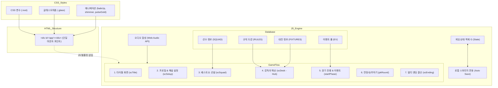

# 라스트 휘슬 (Last Whistle) 사이트 구조 분석 보고서

제시해주신 [라스트 휘슬(Last Whistle)](https://so0yeon.github.io/soccer-coach/) 사이트의 소스 코드를 분석한 결과, 이 웹 앱은 **단일 파일(Single File SPA)**로 빌드된 가볍고 효율적인 **인터랙티브 텍스트 기반 축구 감독 시뮬레이터**입니다.

이 사이트의 기술 스택, 디자인 시스템, 그리고 자바스크립트 비즈니스 로직 구조를 상세히 분석해 드립니다.

---

## 1. 기술 스택 (Technology Stack)

이 웹사이트는 React, Vue 등 무거운 프레임워크나 Tailwind CSS 등의 도구를 사용하지 않고, 오직 **순수 웹 표준 기술(Vanilla Stack)**만을 사용해 제작되었습니다.

* **HTML5**: 앱의 구조 레이아웃 정의 (`

` 단 하나의 컨테이너만 본문에 두고 모든 화면을 동적 렌더링).
* **Vanilla CSS**: CSS 커스텀 변수(`:root`)를 적극 활용한 다크 모드 및 글래스모피즘(Glassmorphism) 테마 구현.
* **Vanilla JavaScript (ES6+)**: 데이터 구조 관리, 게임 루프, 화면 전환 렌더링, 오디오 합성 등 모든 논리 담당.
* **Google Fonts**: Serif 타이틀용 `Noto Serif KR` 및 본문/UI용 `Noto Sans KR` 웹 폰트 로드.

---

## 2. 디자인 시스템 및 CSS 연출 (Aesthetics & CSS)

디자인 측면에서 정교한 스타일링이 적용되어 유저에게 고전적인 풋볼 매니저 게임의 감성과 현대적인 모바일 UI 느낌을 동시에 제공합니다.

### 🎨 색상 팔레트 & 테마 (`:root`)
* **메인 다크 테마**: 심해 느낌의 네이비 컬러군 (`--navy: #0D1A30`, `--navy2: #142540`, `--navy3: #1C3154`)을 바탕에 배치하고 배경에 부드러운 라디알 그라데이션을 겹쳐 깊이감을 구현했습니다.
* **하이라이트**: 전통적인 금색 계열 (`--gold: #C9A227`, `--gold2: #E8C95C`)을 사용해 프리미엄 타이틀 느낌을 부여했습니다.
* **종이 질감 테마**: 수첩, 신문 스크랩 등 오프라인 문서를 시각화할 때 베이지톤 (`--paper: #F8F5EE`, `--paper2: #E9E2D0`)으로 급격히 전환되어 훌륭한 시각적 대비를 이룹니다.

### ✨ 특수 효과 및 연출
* **글래스모피즘 (Glassmorphism)**: 카드 컴포넌트에 `.glass` 클래스를 주어 반투명 흰색 배경(`rgba(255,255,255,.08)`), 미세한 테두리(`border: 1px solid rgba(255,255,255,.16)`), 그리고 블러 효과(`backdrop-filter: blur(14px)`)를 적용했습니다.
* **마이크로 애니메이션**: 
  * 화면이 바뀔 때 부드럽게 위로 솟아오르며 폼이 잡히는 `@keyframes fadeUp`.
  * 중요 버튼이나 이벤트 팝업 시 적용되는 `@keyframes pop`.
  * 우승 배너 등의 텍스트 배경을 흐르게 만드는 `@keyframes shimmer`.
  * 커피잔 메뉴(다음 행동 개시) 주위로 금빛 아우라가 퍼지는 `@keyframes pulseGold` 효과가 적용되어 UI가 살아 숨 쉬는 듯한 인상을 줍니다.

---

## 3. 자바스크립트 로직 구조 (JavaScript Architecture)

앱은 전체 코드가 직렬적으로 실행되는 동적 렌더링 구조를 취하고 있습니다. 주요 모듈은 다음과 같이 나뉩니다.

### 🛠️ 유틸리티 및 오디오 합성 엔진
* **단축 셀렉터**: `const $=s=>document.querySelector(s);`를 정의해 DOM 접근을 효율화했습니다.
* **사운드 합성 (Web Audio API)**:
  * 별도의 MP3/WAV 음원 파일 없이, 브라우저 기본 내장 `AudioContext`로 주파수를 조절하여 **효과음을 직접 합성**해 냅니다.
  * 클릭음(`click()`), 휘슬소리(`whistle()`), 골 세리머니 축하음(`goal()`), 승부차기 실패음(`bad()`) 등을 정현파(`sine`), 삼각파(`triangle`), 톱니파(`sawtooth`) 오실레이터로 즉석 생성합니다.

### 💾 세이브 시스템 (Persistence)
* `localStorage`를 사용해 게임 도중 이탈해도 진행 상황(`G` 객체 전체)이 자동으로 유지되는 `store` 래퍼가 구현되어 있습니다.

### 📊 데이터셋 설계
* **`RULES`**: 오프사이드, 핸드볼, VAR, 경고, 퇴장, DOGSO 등 현대 축구 규칙의 핵심을 담았습니다. 선택한 해설위원(초보 해설, 전문 해설, 전직 감독 캐릭터)에 따라 설명 텍스트가 다르게 출력됩니다.
* **`SQUAD`**: 18명의 가상 태극전사 데이터(백한결, 강도윤, 이도현 등)로 포지션, OVR(능력치), 특징을 담은 객체 리스트입니다.
* **`FIXTURES`**: 조별리그 1차전(멕시코)부터 결승전(독일)까지 상대국 OVR 가중치와 플레이 스타일 정보를 사전에 기록해 두었습니다.
* **`EV` (이벤트 풀)**: 100여 개가 넘는 랜덤 상황(라커룸 신경전, 폭우 대처, 전술 지시, VAR 판독 판단 등)이 저장되어 있으며, 각각의 선택에 따른 사기/체력/언론/OVR 변동 수치가 정의되어 있습니다.

### 🔄 게임 루프 및 경기 시뮬레이션
* 게임 상태를 담는 `G` 객체가 중심이 됩니다.
  * `G.screen`: `'title'`, `'setup'`, `'squad'`, `'desk'`, `'match'`, `'report'`, `'ending'` 등 현재 화면 상태 기록.
  * `G.match`: 진행 중인 경기의 현재 스코어, 추가시간, 교체 횟수, 로그 텍스트 등을 기록.
* **경기 엔진 (`startPhase()`, `pkRound()`)**:
  * 경기 전반, 후반, 추가시간 등 페이즈별로 확률을 연산하고 선택지를 띄웁니다.
  * 골 득점 여부는 우리 팀의 OVR 총합, 상대 OVR 가중치, 선택한 전술 상성, 그리고 감독의 능력치 가중치(`psy` 심리전, `tac` 전술 등)에 영향을 받습니다.
  * 무승부 시에는 연장전과 승부차기(`shootout`) 로직으로 흐름이 분기되어 서든데스 승부까지 시뮬레이션합니다.

### 🏆 업적 및 멀티 엔딩 시스템 (`scEnding()`)
* 최종 경기 종료 시점까지 누적된 지표(`G.flags`)와 감독 스탯을 기반으로 엔딩 20종 이상 중 적합한 것들을 다중 판정합니다.
  * 예: 무패 우승 시 `'무패 우승' / '전설의 감독'`, 카드가 없을 시 `'페어플레이의 사도'`, 승부차기를 여러 번 이기면 `'승부차기의 황제'` 등 타이틀을 부여하고 누적 진열장에 기록합니다.

---

## 4. 구조 요약 (Architecture Summary)

### 💡 주요 특징적 강점
1. **의존성 제로(Zero-dependency)**: 라이브러리를 하나도 다운로드하지 않아 페이지 로딩이 즉각적(0.1초 미만)입니다.
2. **리치 인터랙션**: 정밀한 다크모드 배색과 카드 모션을 통해 텍스트 중심 게임임에도 세련되고 프리미엄한 연출감을 제공합니다.
3. **지속성**: 페이지를 새로고침하더라도 게임 데이터가 보존되는 로컬 스토리지 연동 설계가 잘 잡혀 있습니다.
